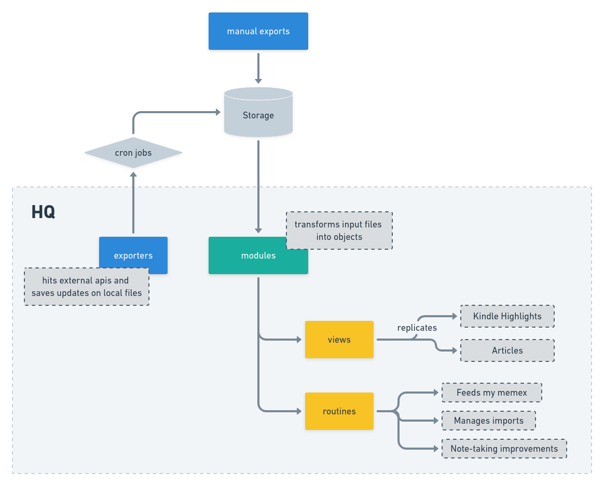

# HQ

[HPI](https://github.com/karlicoss/HPI) got me inspired and I'm trying to play with the idea in smaller scale for myself.

- **What is this?** This is a library to deal with all the data that I wanna keep.
- **What can it do?** A lot of things.
    - Export my personal data from external APIs
        - Github notifications and events
        - Nubank
        - RescueTime stats
        - Toggl
    - Manage a import process of all my data to a single database
        - All the above plus:
        - Bash commands
        - Chrome
        - Habits
        - Articles
        - Daylio
    - Expose the database through a simple API
    - Integrates some tools to make my workflow easier

- **How?**



### Notes

#### TIL (29/06/2021):
- Twint to export tweets:
```bash
sudo chmod 777 /var/run/docker.sock
docker build -t twint .
docker run -d twint
docker run -it <id> bash
twint -u _rebecasarai -o my_tweets.json --json
docker cp <id>:/root/my_tweets.json ~/my_tweets.json
```

#### Full text search with Mongo
- https://docs.mongodb.com/manual/text-search/

#### TIL (28/04/2021):
- You can open a sqlite dataset in readonly mode: https://docs.python.org/3/library/sqlite3.html#sqlite3.connect
- dataset: databases for lazy people: https://dataset.readthedocs.io/en/latest/


#### TIL (27/02/2021):
- appdirs is a lib to help to deal with directories for storing data
- pathlib has nice abstractions to deal with paths on the system, especially checking if they exists or create new ones
- other libs also use the trick to add modules on the path
- method `isatty()` -> True if the file is connected (is associated with a terminal device) to a tty(-like) device (https://gist.github.com/rduplain/e063114479e7470db8d3)
```python
import sys

if sys.stdin.isatty():
    print('you are a tty')
else:
    print('you are not a tty')
```
```bash
$ python isatty.py
you are a tty
$ echo foo | python isatty.py
you are not a tty
$
```

#### TIL (21/03/2021):
- `os.path.expanduser(path)` On Unix and Windows, return the argument with an initial component of ~ or ~user replaced by that user’s home directory


## TODO
- [ ] Refactor all modules to use pydantic (eg: `hq/modules/nubank.py`). The advantage is that it simplifies `handler.py`.

